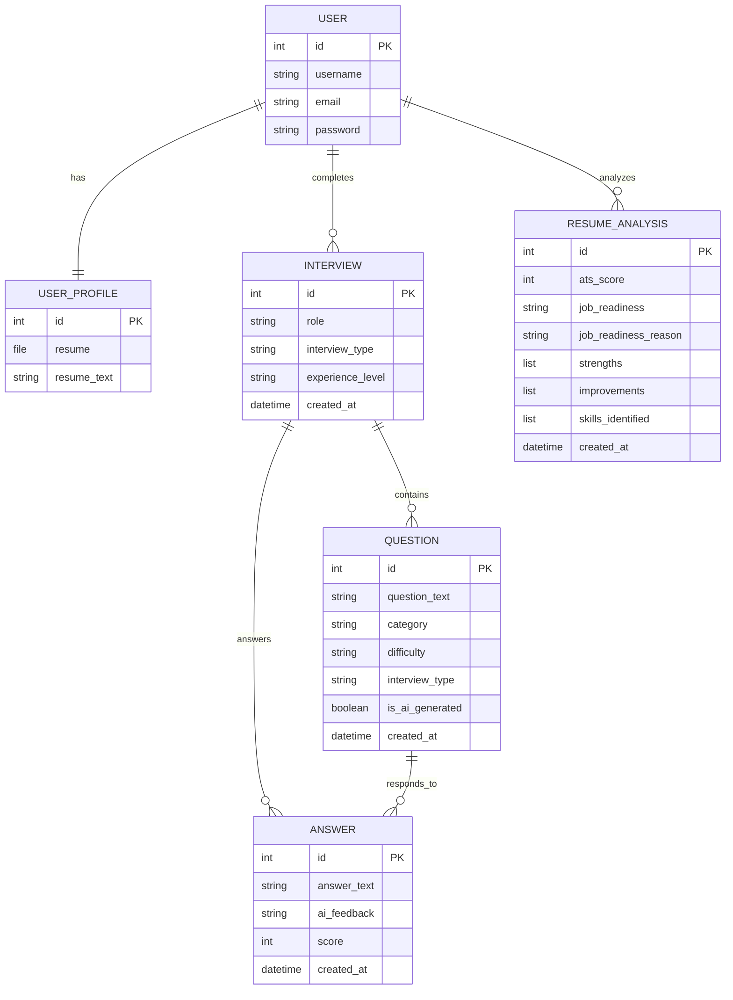

# BitWisePrep - AI-Powered Mock Interview Platform

BitWisePrep is a state-of-the-art web application designed to help candidates prepare for technical and HR interviews through interactive AI mock sessions, real-time grading, automated MCQ assessments, and resume analysis.

---

## 🛠️ Technology Stack

### 💻 Frontend (Client)
- **Framework**: React.js (built with Vite)
- **Styling**: Tailwind CSS (v4)
- **Router**: React Router DOM (v7)
- **Animations**: Framer Motion
- **Icons**: Lucide React
- **Notifications**: React Hot Toast
- **HTTP Client**: Axios (configured with interceptors for JWT token refreshes)

### ⚙️ Backend (Server)
- **Framework**: Django & Django REST Framework (DRF)
- **WSGI Production Server**: Gunicorn (for Linux deployment)
- **Static files handler**: WhiteNoise (efficiently serves static files directly via Django)
- **Authentication**: SimpleJWT (JSON Web Tokens: access & refresh rotation)
- **Database**: SQLite (Local Dev) / PostgreSQL (Render Production) using `dj-database-url`

### 🤖 Artificial Intelligence Services
- **Primary AI Provider**: Google Gemini API (`gemini-2.0-flash`)
- **Fallback AI Router**: OpenRouter (`openrouter/auto`) to dynamically query high-quality free models (such as DeepSeek-R1-Distill) when direct rate-limits or quota limits are exceeded.

---

## 📁 Project Architecture & Directory Layout

```
ai-mock-interview/
├── Frontend/                      # React Frontend App
│   ├── src/
│   │   ├── api/                   # API configurations (axios.js)
│   │   ├── components/            # Reusable UI parts (HelpCenterModal, NavBar, Footer, etc.)
│   │   ├── layouts/               # Page layouts (AuthLayout)
│   │   ├── pages/                 # Routing page views (Home, Login, Signup, Dashboard, Setup)
│   │   ├── index.css              # Custom global styles (autofill override rules)
│   │   └── main.jsx               # App entrypoint
│   └── package.json               # Frontend dependencies
│
├── Backend/                       # Django REST API Backend
│   ├── core/                      # Main Django configuration app (settings.py, urls.py, wsgi.py)
│   ├── users/                     # App for Auth, Profiles, and Resume analysis (ai_service.py)
│   ├── interviews/                # App for Mock Interview setup, Q&A (ai_services.py, views.py)
│   ├── assessments/               # App for MCQ Assessments (ai_service.py)
│   ├── feedback/                  # App for AI response evaluation (ai_service.py)
│   ├── requirements.txt           # Backend dependencies (Gunicorn, psycopg2, dj-database-url)
│   └── manage.py                  # Django administrative script
│
└── project_overview.md            # This document
```

---

## 🗄️ Database Schema & Models



---

## ✨ Implemented Custom Features & Fixes

### 1. Unified Help Center & Support Modal
* Added a functional **Help Center & support** button directly in the footer (requires no additional routing).
* Opens a glassmorphic modal offering:
  * Prominent support contact: `sujitcoder044@gmail.com`.
  * One-click **Copy Email** (with visual confirmation) and **Send Email** (`mailto`) actions.
  * Collapsible FAQ Accordion for direct candidate assistance.

### 2. Browser Input Autofill CSS Patch
* Fixed a common browser issue where autocomplete turns textbox backgrounds white, breaking dark themes.
* Implemented a global override in [index.css](file:///e:/web_dev%20std/bitWise_Prep/ai-mock-interview/Frontend/src/index.css) to force inputs to match `slate-800` (`#1e293b`) with white text and an delayed background transition:
  ```css
  input:-webkit-autofill {
    -webkit-text-fill-color: #ffffff !important;
    -webkit-box-shadow: 0 0 0px 1000px #1e293b inset !important;
    transition: background-color 5000000s ease-in-out 0s !important;
  }
  ```

### 3. Bulletproof AI Fallback Engine
* Overcame API rate limits (`429 Quota Exceeded` errors) on the free tier.
* All AI endpoints (Question Generation, Resume Analysis, Feedbacks, and MCQ Assessments) utilize a dual-client system:
  * **Phase 1**: Attempts direct connection to Gemini (`gemini-2.0-flash`).
  * **Phase 2**: On exception, automatically falls back to OpenRouter auto-routing (`openrouter/auto`) which maps requests to active free models.
  * **Token Headroom**: Increased token caps (up to `2000` tokens) to allow reasoning models (like DeepSeek-R1-Distill) to write full reasoning traces and output complete JSON payloads without truncation.
  * **Database Seeding Fallback**: If the database on Render has 0 questions due to sqlite resets, the system dynamically inserts fallback questions using `get_or_create` to ensure the candidate always gets 5-10 DB questions and 5-10 AI questions with valid primary keys.

---

## 🚀 Deployment Guide

### Frontend (Vercel)
- Placed on: `https://ai-mock-interview-alpha-cyan.vercel.app`
- Directs requests to backend URL: `https://ai-mock-interview-s5ou.onrender.com/api`

### Backend (Render)
- Placed on: `https://ai-mock-interview-s5ou.onrender.com`
- **Build Command**: `pip install -r requirements.txt`
- **Start Command**: `cd Backend && python manage.py migrate && gunicorn core.wsgi:application`
- **Required Environment Variables**:
  * `PYTHON_VERSION` = `3.11.9` or `3.12.3` *(essential to prevent binary incompatibility crashes in Python 3.14)*
  * `SECRET_KEY` = *[Your Django Secret]*
  * `OPENROUTER_API_KEY` = *[Your OpenRouter API Key]*
  * `GEMINI_API_KEY` = *[Your Gemini API Key]*
  * `DATABASE_URL` = *[Your PostgreSQL connection string]*
